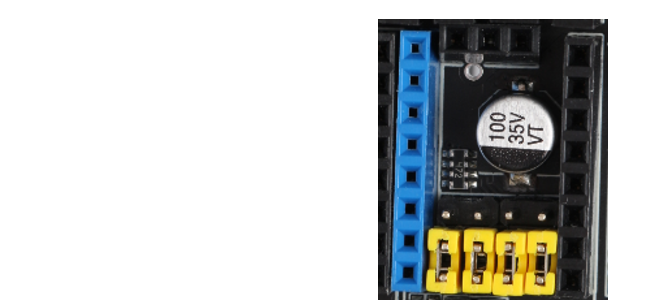
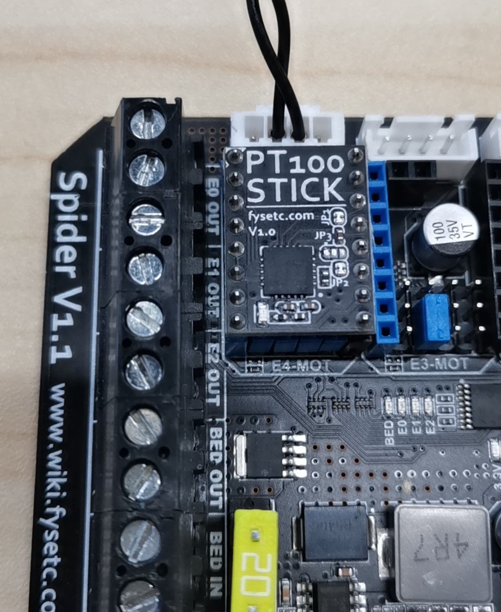

# FYSETC-PT100Stick
FYSETC-PT100Stick is a Pololu formfactor MAX31865 breakboard for FYSETC S6/Spider and similar 32 bit 3D printer control boards. It is base on VORON [PT100Stick](https://github.com/VoronDesign/Voron-Hardware/tree/master/PT100Stick).

## How to use

### Set the jumpers



Then insert it to the socket.



### Klipper

1. SSH into your `RaspberryPi` and edit your `printer.cfg` file using `nano`.

2. Remove any old thermistor configuration under [extruder]. (sensor_type, sensor_pin, etc.)

3. Under [extruder] add these lines:

   ```
   sensor_type: MAX31865
   sensor_pin: PD11 # I pulg into Spider E4-MOT socket, `cs` pin is the sensor pin
   spi_speed: 4000000
   spi_software_sclk_pin: PE12
   spi_software_mosi_pin: PE14
   spi_software_miso_pin: PE13
   rtd_nominal_r: 100
   rtd_reference_r: 430
   rtd_num_of_wires: 2
   ```

4. If you are in EU or any 50 Hz country add this line: `rtd_use_50Hz_filter: True`

5. Save your changes by typing CTRL+X, Y, [ENTER]. Send FIRMWARE_RESTART from the console in Octoprint and test! It should work.

6. Run PID tuning. PT100 readings will be different from your previous thermistor. For the best thermal accuracy, follow this to PID tune:

   ```
   1. Heat your bed to 100C.
   2. Move your hothend to the center and 5-10 mm above bed
   3. Set fans to 25%: "M106 S64"
   4. Run: "PID_CALIBRATE HEATER=extruder TARGET=245"
   5. This will run for a few minutes. When finished, save with: "SAVE_CONFIG"
   ```

### Marlin

